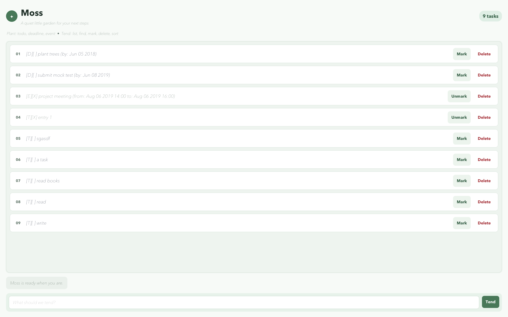

# Moss User Guide

Moss is a quiet task garden for keeping track of todos, deadlines, and events. You can plant tasks, mark them as complete, search or sort them, and prune them when they are no longer needed.



## Getting started

Moss requires JDK 25. From the project folder, start the application with Gradle:

```bash
./gradlew --console=plain run
```

On Windows, use:

```bat
gradlew.bat --console=plain run
```

Type a command in the box at the bottom of the window and press **Enter** or click **Tend**. The task cards show each task's number, completion status, and available **Mark**, **Unmark**, and **Delete** actions.

## Features

### Plant a todo

Use a todo for a task without a date or time.

```text
todo <description>
```

Example:

```text
todo read the software engineering textbook
```

### Plant a deadline

Use `/by` followed by a date or date/time. Moss accepts dates in `yyyy-MM-dd` or `d/M/yyyy` format, and date/times in `yyyy-MM-dd HHmm`, `yyyy-MM-dd HH:mm`, `d/M/yyyy HHmm`, `d/M/yyyy HH:mm`, or ISO date/time format.

```text
deadline <description> /by <date or date/time>
```

Examples:

```text
deadline return library book /by 2019-06-06
deadline submit report /by 2/12/2019 1800
```

### Plant an event

Use `/from` and `/to` to give an event its start and end times.

```text
event <description> /from <start> /to <end>
```

Example:

```text
event project meeting /from 2019-08-06 1400 /to 2019-08-06 1600
```

### View and search tasks

Show every task with its current number:

```text
list
```

Search descriptions without regard to letter case:

```text
find <keyword>
```

Example:

```text
find book
```

### Sort dated tasks

Arrange deadlines by due date and events by start time:

```text
sort
```

Todos without dates remain after the dated tasks. Moss saves the new order automatically.

### Mark, reopen, and delete tasks

Use the number shown by `list`:

```text
mark <task number>
unmark <task number>
delete <task number>
```

Examples:

```text
mark 2
unmark 2
delete 1
```

You can also use the buttons on each task card for these actions.

### Leave Moss

Enter the following command to close the application:

```text
bye
```

## Saving your tasks

Moss saves changes automatically after adding, marking, unmarking, deleting, or sorting a task. Saved tasks are stored in `data/moss.txt` relative to the folder from which Moss is started, and are restored the next time it runs.

On the first run, Moss starts with an empty garden if the data file does not exist. The `data` folder and file are created automatically after the first task change.

## If something goes wrong

- If a command is incomplete or has the wrong format, Moss shows an explanation and keeps the application open so you can try again.
- Task commands such as `mark`, `unmark`, and `delete` require a valid whole-number task number from `list`.
- Deadline and event dates must use one of the supported formats shown above.
- If Moss cannot read the data file, it starts with an empty garden and shows a warning. If it cannot save a change, it keeps the change in the current session and shows a warning so you can correct the file location or permissions.

## Example session

```text
todo read a book
deadline submit assignment /by 2019-12-06
event team meeting /from 2019-12-06 1000 /to 2019-12-06 1100
find meeting
mark 1
sort
bye
```
